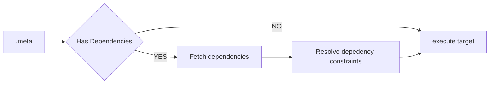

# Metadata processing

```mermaid
flowchart LR
    A[.meta] --> C{Has Dependencies}
    C -->|YES| D[Fetch dependencies]
    C -->|NO| E[execute target]
    D --> F[Resolve depedency constraints]
    F --> E[execute target]
```